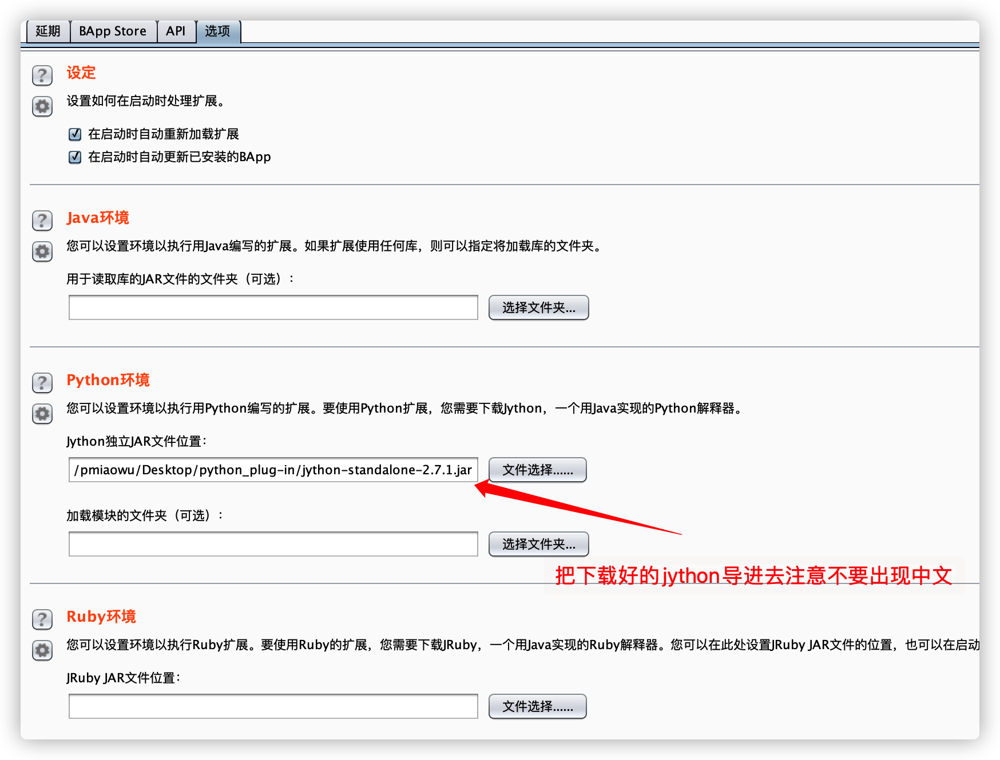

# 简介

一个可怜兮兮还不知道自己唯一使命的Burpsuite 转发插件 (°ー°〃)愣住

注意: 该插件只会在以下几个burp模块运行
- Burp Proxy模块

此插件最大的作用就是配合作者其他的Burp插件进行漏洞扫描

# 功能

此插件会把所有的“Burp Proxy模块请求”转发到“Burp Scanner模块”进行扫描

# 安装过程

Jython官网: https://www.jython.org/downloads.html

Jython环境安装包: http://search.maven.org/remotecontent?filepath=org/python/jython-standalone/2.7.0/jython-standalone-2.7.0.jar

# 使用例子

安装完毕以后,任意打开一个url链接就可以了

例如打开任意一个网站

# 注意项-关于请求不转发的问题

如果你发现一个“Burp Proxy模块请求”第一次可以成功转发到“Burp Scanner模块”,后面都不转发了,请注意,这不是Bug!!!,这不是Bug!!!,这不是Bug!!!

这是因为我添加了Url重复检测的判断

你可以查看插件根目录下的“test_logs”文件夹,里面会以你的扫描域名生成一个“xxxx.com-xx年-xx月-xx日.log"

这个log会记录“Burp Proxy模块请求”转发到“Burp Scanner模块”的Url

解决方案:
1. 通过这个插件的Tag来关闭Url重复检测的功能
2. 可以删除对应域名的文件,这样它就会重新转发了

# Url黑名单添加

在根目录你可以看到“black_url.txt”文件,打开此文件,一行一域名添加即可

每个在“black_url.txt”文件里面的url此插件都不会进行转发

# Tag面板配置项

# Url调试功能添加

新参数: is_burp_debug=True/False
请求方法: Get

功能: 如果您想调试某个url但是又不想此插件转发请求出去可以通过此功能实现

## Url调试功能例子:

例如说我现在有一个url: https://github.com/pmiaowu

以前我们一访问他请求就转发到“Burp Scanner模块”了

现在您可以输入: https://github.com/pmiaowu?is_burp_debug=True

那么此请求就不会转发了 :)

